# AI-Powered Product Description Generator (Generative AI)

# Project Overview

   

## 1. Data Input Phase Overview

The data input phase is a crucial foundation of the AI-powered product description generator. This phase encompasses multiple components working together to collect and validate essential product information.

### 1.1 User Input Components

- **Product Information Collection**
    - Product name and identifier
    - Category and subcategory classification
    - Detailed specifications and features
    - Price point and target market
- **Visual Content Integration**
    - Image upload functionality
    - Image validation (format, size, quality)
    - Multiple angle support
- **Brand Voice Configuration**
    - Tone selection (professional, casual, technical)
    - Style preferences
    - Target audience parameters
    - Brand-specific keywords and phrases

### 1.2 Technical Flow

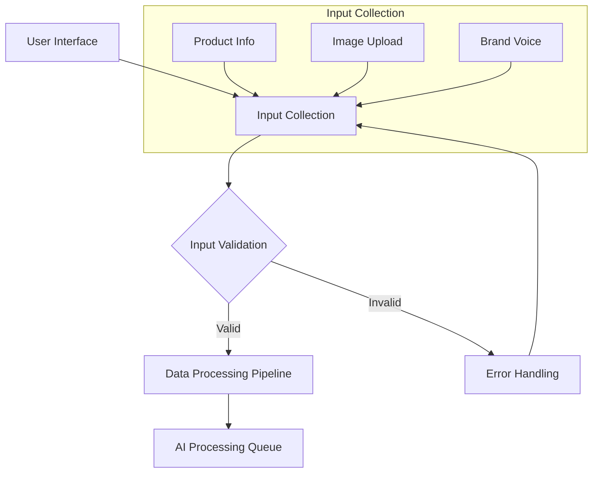

### 1.3 Data Validation Process

The validation process ensures data quality and system integrity through multiple checkpoints:

- **Input Validation Layers**
    - Field-level validation (required fields, format checking)
    - Content type verification
    - Image validation (resolution, size, format)
    - Brand voice parameter validation

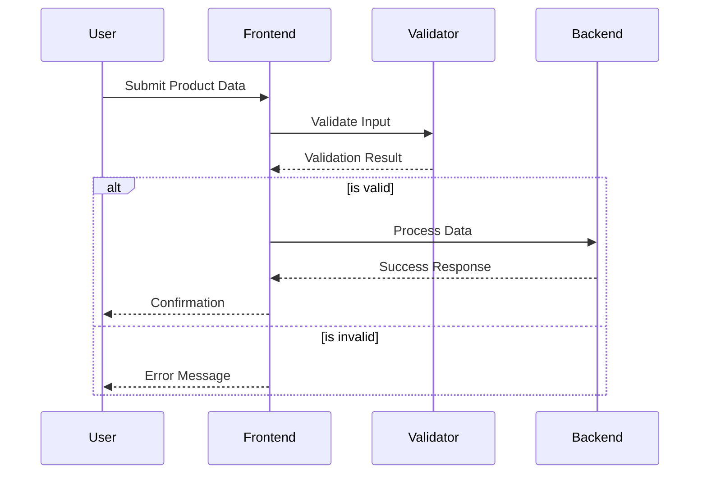

### 1.4 Frontend Architecture

The frontend implementation utilizes a modular approach with the following components:

- **UI Components**
    - Dynamic form elements
    - Real-time validation feedback
    - Progress indicators
    - Preview functionality
- **State Management**
    - Form state tracking
    - Input history
    - Validation state
    - Upload progress monitoring

### 1.5 Error Handling

Comprehensive error handling ensures a smooth user experience:

- **Error Categories**
    - Input validation errors
    - File upload issues
    - Network connectivity problems
    - Server-side processing errors

Each error is caught, logged, and presented to the user with clear resolution steps.

## 2. AI Processing Phase Overview

The AI Processing Phase represents the core intelligence of the product description generator, where collected data is transformed into compelling product descriptions through multiple sophisticated processing steps.

### 2.1 Data Processing Pipeline

- **Text Processing Components**
    - Natural Language Processing (NLP) tokenization
    - Entity recognition and extraction
    - Semantic analysis of product features
    - Context preservation and enrichment
- **Image Processing Pipeline**
    - Computer vision feature extraction
    - Object detection and classification
    - Visual attribute analysis
    - Context integration with textual data

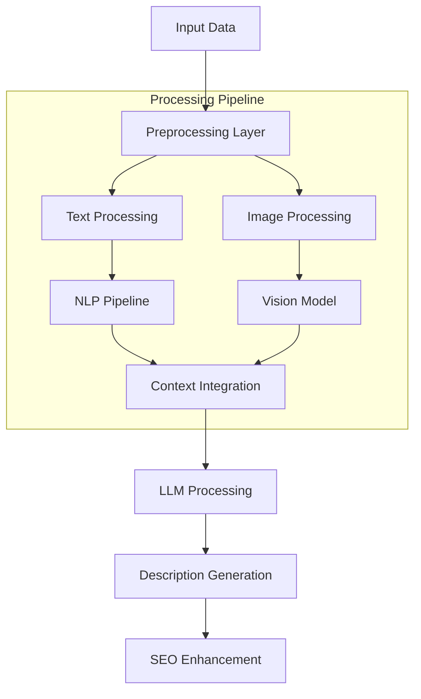

### 2.2 LLM Integration

The system leverages advanced Language Learning Models for description generation:

- **Model Architecture**
    - Integration with GPT-4 or similar advanced LLMs
    - Custom prompt engineering framework
    - Context-aware generation parameters
    - Multi-pass refinement process

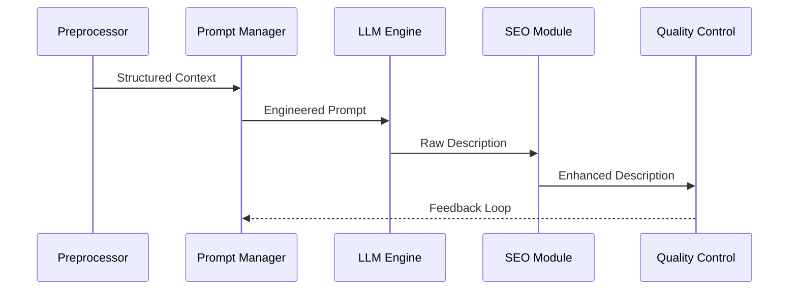

### 2.3 SEO Enhancement Module

The SEO module optimizes generated descriptions for search engine visibility:

- **SEO Components**
    - Keyword research and integration
    - Metadata optimization
    - Search engine compliance checking
    - Readability score analysis

### 2.4 Quality Assurance

Multiple quality checks ensure the generated descriptions meet specified standards:

- **Quality Control Measures**
    - Grammar and syntax verification
    - Brand voice consistency checking
    - Technical accuracy validation
    - SEO compliance verification

The AI Processing Phase concludes with a comprehensive review system that ensures all generated content aligns with quality standards and brand guidelines while maintaining optimal search engine visibility.

## 4. Review and Optimization Phase Overview

The Review and Optimization Phase represents the final quality control gateway, ensuring all generated content meets the highest standards of accuracy, originality, and effectiveness. This phase implements multiple layers of validation and enhancement processes.

### 4.1 Content Quality Validation

The quality validation process employs a multi-stage approach to ensure content excellence:

- **Validation Components**
    - Advanced grammar and spelling verification system
    - AI-powered natural language enhancement
    - Context-aware error detection
    - Style consistency verification

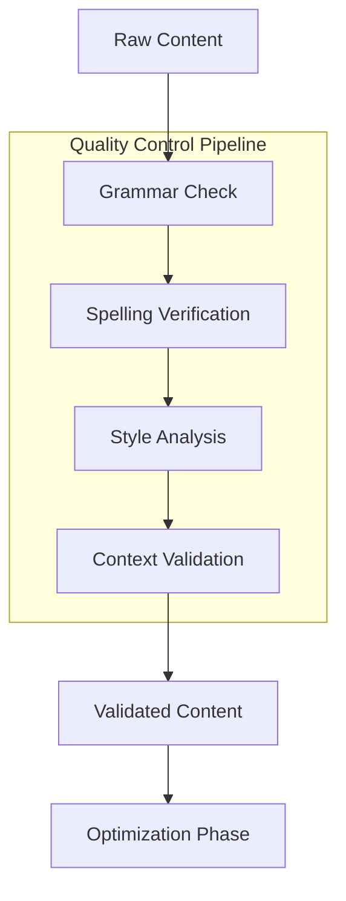

### 4.2 Originality Verification System

The plagiarism detection module provides comprehensive content uniqueness validation:

- **Originality Check Components**
    - Cross-reference database comparison
    - Semantic similarity analysis
    - Source attribution verification
    - Content uniqueness scoring

### 4.3 Brand Voice Consistency Framework

A sophisticated filtering system ensures alignment with established brand guidelines:

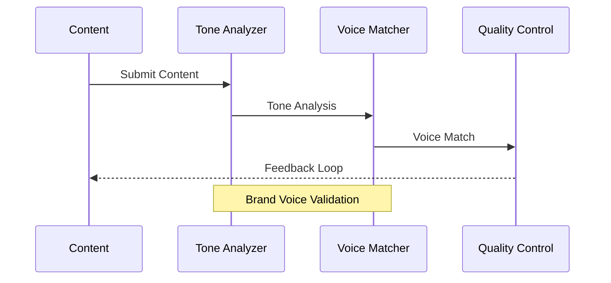

### 4.4 SEO Optimization Framework

The SEO evaluation system employs advanced analytics to optimize content for search engine visibility:

- **SEO Analysis Components**
    - Keyword density and placement optimization
    - Readability score assessment
    - Meta-content optimization
    - Search ranking potential analysis

### 4.5 LangSmith Integration

LangSmith provides comprehensive monitoring and optimization capabilities:

- **LangSmith Implementation**
    - Real-time chain performance monitoring
    - Prompt effectiveness analysis
    - Output quality metrics tracking
    - System optimization recommendations

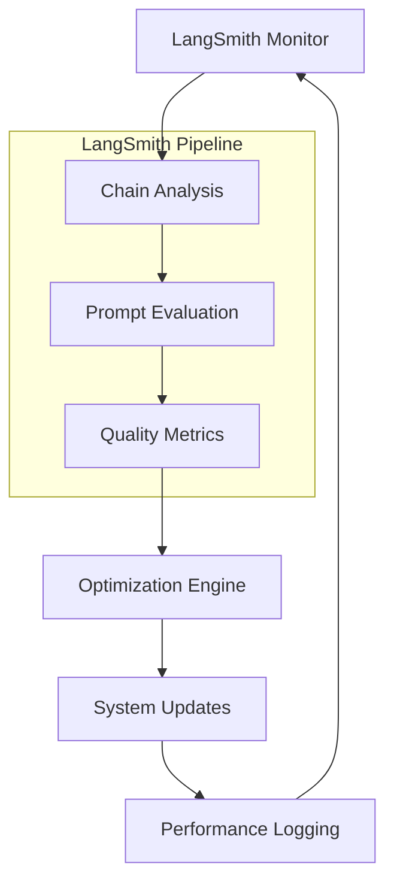

The Review and Optimization Phase concludes with a comprehensive performance analysis report, documenting all validation results and optimization recommendations for continuous system improvement.

## 5. Output and Integration Phase Overview

The Output and Integration Phase focuses on making the generated content accessible and deployable across various platforms and systems, ensuring maximum utility and flexibility for end users.

### 5.1 Export Functionality

The system supports comprehensive export capabilities to accommodate different use cases:

- **Export Format Options**
    - HTML format with semantic markup
    - Markdown for content management systems
    - Plain text for universal compatibility
    - Structured JSON for API integrations

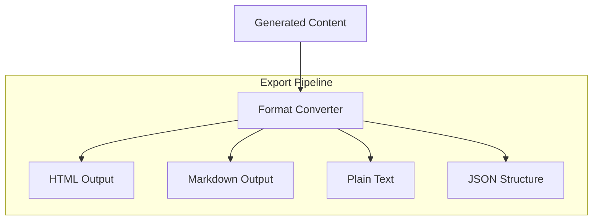

### 5.2 E-commerce Platform Integration

Seamless integration with major e-commerce platforms ensures efficient content deployment:

- **Platform Connectors**
    - Shopify integration module
    - Magento compatibility layer
    - WooCommerce integration system
    - Custom platform adapters

### 5.3 Bulk Processing System

The bulk processing module enables efficient handling of large product catalogs:

- **Bulk Operations**
    - Batch processing configuration
    - Progress tracking and reporting
    - Error handling and recovery
    - Performance optimization for large datasets

### 5.4 API Architecture

RESTful API endpoints provide programmatic access to the system:

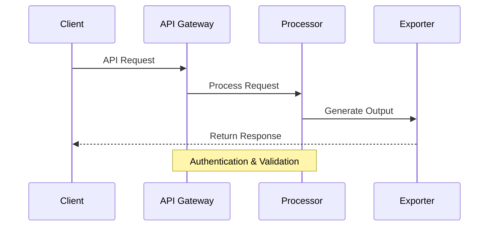

- **API Features**
    - Secure authentication and authorization
    - Rate limiting and quota management
    - Comprehensive documentation
    - Response format customization

The Output and Integration Phase ensures that generated content can be effectively utilized across different platforms and systems, maximizing the value of the AI-powered description generator.

## 6. Feedback Loop Phase Overview

The Feedback Loop Phase implements a comprehensive system for monitoring, analyzing, and improving the performance of generated product descriptions through continuous data collection and analysis.

### 6.1 Performance Metrics Tracking

Advanced analytics systems monitor key performance indicators:

- **Core Metrics**
    - Real-time conversion rate tracking
    - Average time spent on product pages
    - Bounce rate analysis
    - Click-through rate monitoring

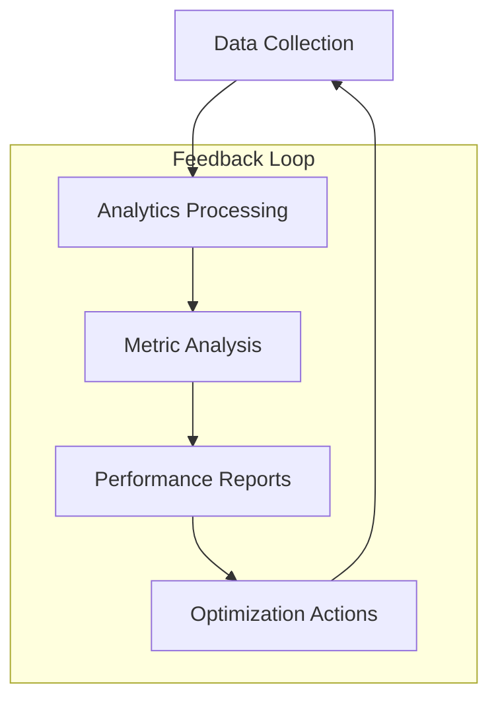

### 6.2 User Feedback System

Structured collection and analysis of user feedback ensures continuous improvement:

- **Feedback Components**
    - User satisfaction surveys
    - Description relevance ratings
    - Clarity and effectiveness scoring
    - Customer suggestion collection

### 6.3 A/B Testing Framework

Systematic testing of description variants enables data-driven optimization:

- **Testing Elements**
    - Description style variations
    - Tone and voice alternatives
    - Format and structure options
    - Call-to-action effectiveness

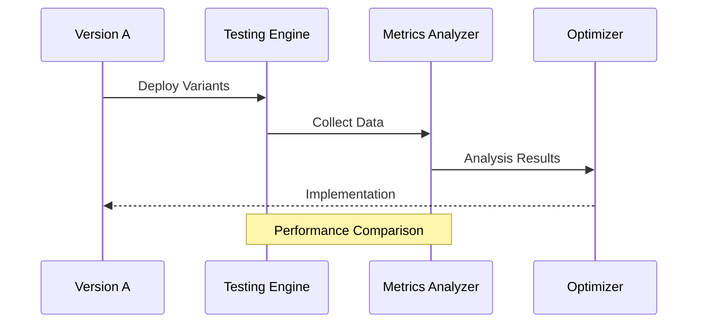

### 6.4 Model Fine-tuning Pipeline

Continuous model improvement through systematic refinement:

- **Optimization Process**
    - Data-driven prompt engineering
    - Parameter optimization
    - Context enhancement
    - Performance-based adjustments

The Feedback Loop Phase creates a continuous improvement cycle that ensures the system evolves and adapts based on real-world performance data and user feedback.